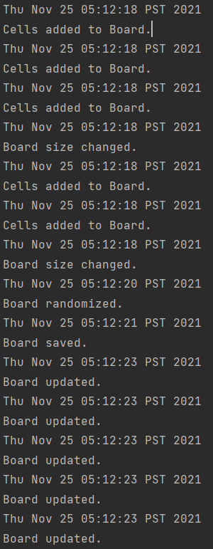
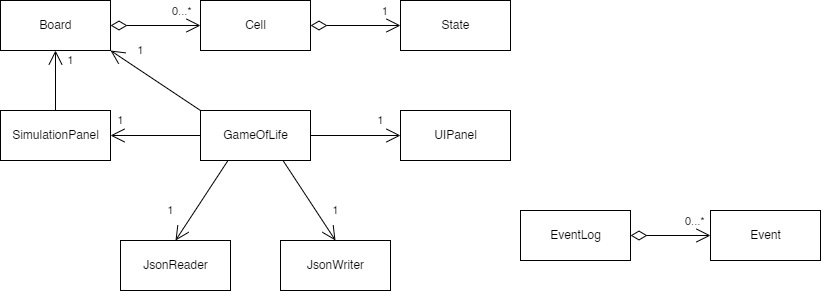

# Conway's Game of Life

## What's the Game of Life?

Welcome to the *Game of Life*! The Game of Life is a type of
*cellular automata* that was devised by English mathematician 
John Horton Conway in 1970. You have a grid of cells in 
which each cell exist in one of two states: dead or alive. 
Every iteration of the game, cells exchange information
with their neighbors and update their own state according
to the state of their neighbors. This can lead to the 
spontaneous emergence of some interesting patterns and 
structures. 

The inspiration for this project came 
after watching *The Art of Code* 
by Dylan Beattie. This is where I saw a demonstration of
The Game of Life, and I've been itching to write 
my own implementation ever since. In case you're interested, 
the talk can be seen here:

https://www.youtube.com/watch?v=6avJHaC3C2U&t=79s

## The Rules

The rules are simple. We answer two questions: 
what keeps a cell alive, and what keeps it dead?

- Live cells require exactly 2 or 3 live neighbors in order
to survive. Anything else will cause it to die by either
  *overpopulation* or *underpopulation*. 
  
- Dead cells can be revived if surrounded by three live 
neighbors through *reproduction*. Otherwise, it stays dead. 
  

## So what does *this* program do specifically?

This program is a simulation
of the Game of Life made in Java. The list of features
can be found in the user stories which I'll update 
throughout the project.

## User Stories

- As a user, I want to be able to add a row of cells to the board. 

- As a user, I want to be able to add a column of cells to the board.
  
- As a user, I want to be able to set the state of individual cells
on the board.
  
- As a user, I want to be able to randomize the board. 

- As a user, I want to be able to save the state of the board to a file. 

- As a user, I want to be able to load the state of the board from a file and
resume the simulation. 

## Phase 4: Task 2
A sample of events that were logged in the Event Log

## Phase 4: Task 3

### Design

### Comments

Let's talk about the main model first. The main model consists of
Board, Cell, and State. This collection of classes was probably 
the most well-designed part of the whole project. There's really
strong cohesion and low coupling here. The Board is responsible 
for finding all the surrounding cells at each index and sending 
that information to an individual cell. Each Cell uses that 
information to update their own state. There's a singular flow of
information from Board to Cell to State and each one acts as a 
container for the other. There's nothing in this sequence that I
would change. 

It started to get messy when I was making the GUI. One thing 
you probably noticed is the transitive relationship between the 
GameOfLife, SimulationPanel, and Board classes. I'm not really
sure what I was thinking, but it looks really silly when I draw
the diagram. I should have given the Board reference to the 
SimulationPanel and had the GameOfLife interact with the
Board through it. 

The GameOfLife class is a mess. It ended up being
this god class that does everything. It contains every single button,
the slider, the timer, the model, and UI components, and the
event handling. I was originally planning on using the UIPanel as
a container for the buttons and slider. That didn't work out due to me 
running out of time. For example, I could have made a separate
Button abstract class. The buttons themselves should have
been stored in a collection in the UIPanel (in case I wanted to 
add more buttons). I ended up just adding all the buttons
individually into the frame. This makes for lots of repetition
where I should have been using loops. The UIPanel is basically useless and
doesn't do anything. 

The Timer functionality could have been separated from the 
GameOfLife class as well as the EventHandling. 

## Updates
- Nov 25, 2021: Finished GUI. 
- Oct 12, 2021: Finished a console based implementation.
- Nov 7, 2021: Added the ability to save and pick off from
where you left off. 
  